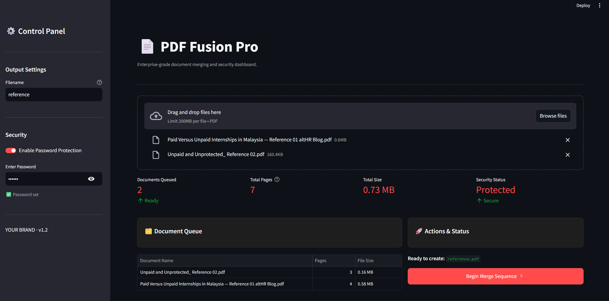

# 📄 PDF Fusion Pro

**A secure, local-first PDF manipulation dashboard built for privacy and speed.**

[](https://mergepdfwizard.streamlit.app)



## 🚀 Overview

PDF Fusion Pro is a modern web application designed to replace unsafe online PDF tools. Built with **Streamlit**, **Pandas**, and **pypdf**, it processes documents entirely on your local machine—ensuring sensitive data never leaves your computer. 

It features a professional "Dark Mode" dashboard, real-time file analytics, bank-grade password encryption, and a **new interactive sequencing engine** to arrange your files exactly how you want them.

## ✨ Key Features

* **🛡️ Privacy First:** 100% local processing. No files are uploaded to external servers.
* **🔢 Smart Reordering:** Interactive data table allows you to edit the merge sequence on the fly—no need to re-upload files to fix the order.
* **📊 Live Analytics:** View real-time metrics including total page count and file size before merging.
* **🔒 Security:** Encrypt your output documents with password protection (AES-128).
* **🎨 Pro UI:** A clean, dark-themed interface with a sidebar for settings and a visual document queue.

## 🛠️ Tech Stack

* **Python 3.10+**
* **Frontend:** [Streamlit](https://streamlit.io/) (Reactive dashboard UI & Data Editor)
* **Data Engine:** [Pandas](https://pandas.pydata.org/) (Dataframe manipulation for file sequencing)
* **Backend:** [pypdf](https://pypi.org/project/pypdf/) (PDF manipulation and encryption)

## 📦 Installation

1.  **Clone the repository**:
    ```bash
    git clone [https://github.com/EF361/pdf_merger.git](https://github.com/EF361/pdf_merger.git)
    cd pdf_merger
    ```

2.  **Create a virtual environment (Recommended)**:
    ```bash
    python -m venv venv
    # Windows
    venv\Scripts\activate
    # Mac/Linux
    source venv/bin/activate
    ```

3.  **Install dependencies**:
    ```bash
    pip install streamlit pypdf pandas
    ```

## 🏃‍♂️ How to Run

### Option 1: Try the Live Demo
You can access the deployed version immediately without installation:
👉 **[Click here to open PDF Fusion Pro](https://mergepdfwizard.streamlit.app)**

### Option 2: Run Locally
1.  **Launch the application**:
    ```bash
    streamlit run pdf_merger.py
    ```

2.  **Access the Dashboard**:
    Open your browser and navigate to `http://localhost:8501`.

## 📖 Usage Guide

1.  **Configure Output:** Open the Sidebar (Left Panel) to set your desired filename.
2.  **Set Security (Optional):** Toggle "Enable Password Protection" in the sidebar to encrypt your file.
3.  **Upload Files:** Drag and drop multiple PDF files into the main upload area.
4.  **Reorder Sequence:** Look at the **Document Queue** table. Click on the numbers in the **"Merge Order"** column and edit them to change the sequence (e.g., change `2` to `1` to move a file to the top).
5.  **Merge:** Click **"Begin Merge Sequence ⚡"** to process and download your file.

## 📂 Project Structure

```bash
pdf_merger_app/
├── venv/                   # Virtual environment
├── pdf_merger.py           # Main application logic & UI
├── dashboard_preview.png   # Screenshot for README
├── requirements.txt        # Dependencies list (streamlit, pypdf, pandas)
└── README.md               # Documentation